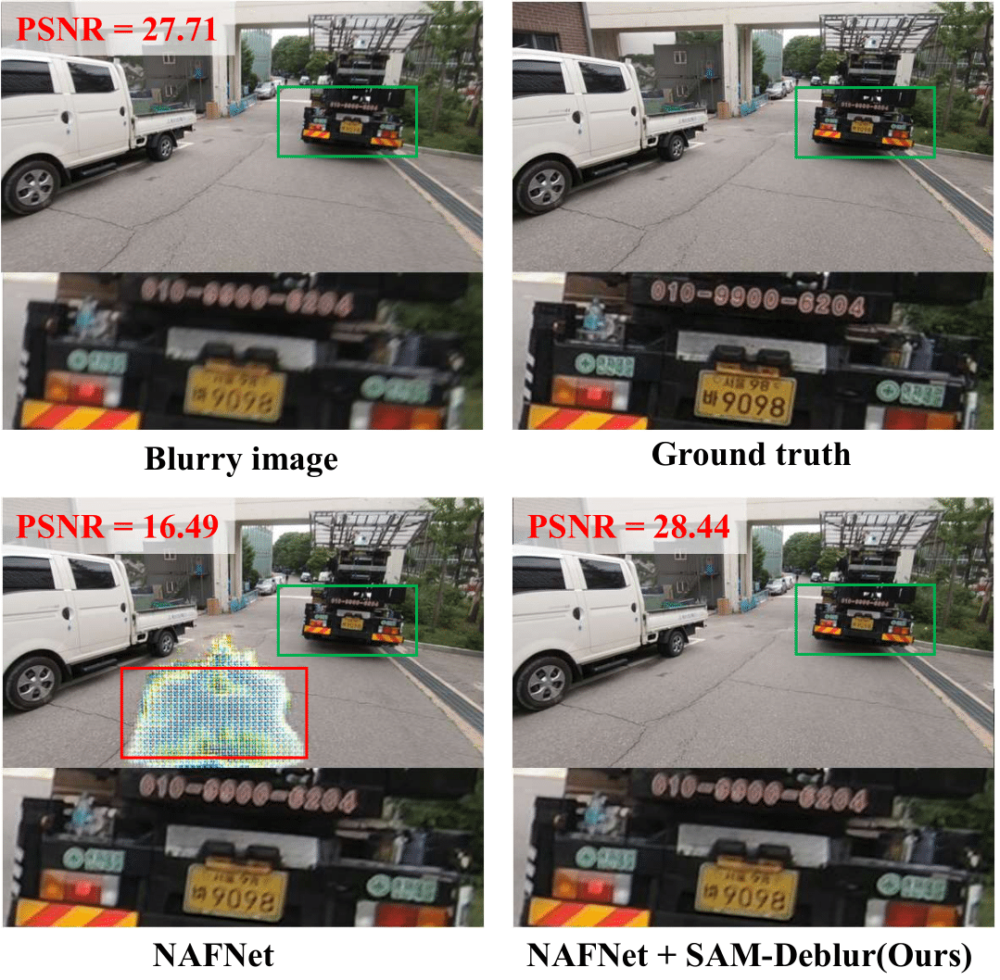
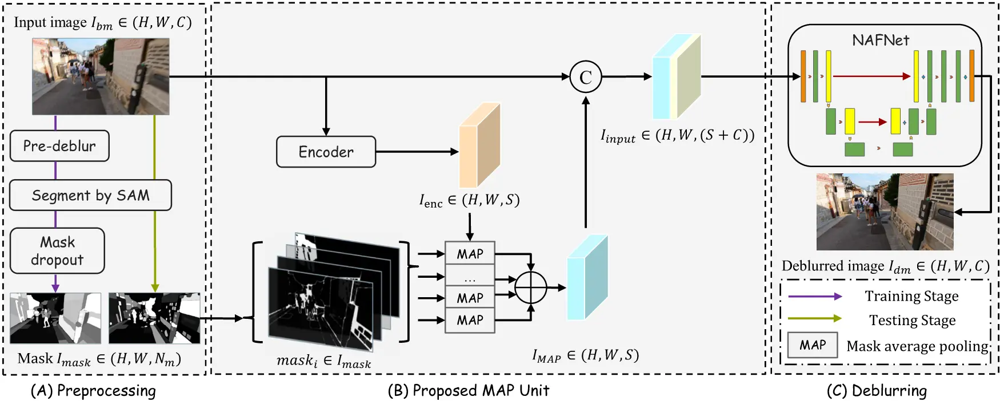

<div class="columns is-centered has-text-centered">
    <div class="column is-four-fifths">
        <h2>Abstract</h2>
        <div class="content has-text-justified">
<strong>Image deblurring</strong> is a critical task in the field of image restoration, aiming to eliminate blurring artifacts. However, the challenge of addressing non-uniform blurring leads to an ill-posed problem, which limits the generalization performance of existing deblurring models. To solve the problem, we propose a framework <strong>SAM-Deblur</strong>, integrating prior knowledge from the <strong>Segment Anything Model</strong> (SAM) into the deblurring task for the first time. In particular, SAM-Deblur is divided into three stages. First, we preprocess the blurred images, obtain segment masks via SAM, and propose a mask dropout method for training to enhance model robustness.  Then, to fully leverage the structural priors generated by SAM, we propose a Mask Average Pooling (MAP) unit specifically designed to average SAM-generated segmented areas, serving as a plug-and-play component which can be seamlessly integrated into existing deblurring networks. Finally, we feed the fused features generated by the MAP Unit into the deblurring model to obtain a sharp image. <strong>Experimental results on the RealBlurJ, ReloBlur, and REDS datasets reveal that incorporating our methods improves GoPro-trained NAFNet's PSNR by 0.05, 0.96, and 7.03, respectively.</strong>
        </div>
    </div>
</div>

---

## Introduction

<div style="width: 50%; margin: auto; text-align: center;">
    
    <p><strong>The "mode collapse" in NAFNet</strong>: NAFNet trained on the GoPro dataset may output anomalous pixel regions during testing on the REDS dataset (indicated by the red boxes). <strong>This problem can be effectively solved by proposed SAM-Deblur.</strong></p>
</div>
<br>

The field of image deblurring faces a significant challenge: **non-uniform blurring leads to an ill-posed problem, which severely limits the generalization capabilities of existing deblurring models**. This issue is evident in scenarios where state-of-the-art models, such as NAFNet, trained on specific datasets like GoPro, fail to perform adequately on out-of-distribution datasets, leading to problems which we call "mode collapse."

**The integration of semantic-aware priors comes as a way to address this challenge. This brings us to the Segment Anything Model (SAM), developed by META.** SAM is a robust model trained on the extensive SA-1B dataset. With training on over 10 billion masks and 11 million images, SAM is capable of performing accurate segmentation on a wide range of images, including those of suboptimal quality. Its robustness in handling blurred images makes it an ideal candidate for providing structural priors for deblurring tasks.

Aiming to regularize the solution space for latent sharp images in deblurring tasks and thereby enhance the generalization performance of existing models, we propose the **SAM-Deblur** framework. This pioneering effort **leverages SAM-generated priors to address the challenges of non-uniform blurring in image deblurring**.

## Method

<div style="width: 85%; margin: auto; text-align: center;">
    
</div>
<br>

**The SAM-Deblur Pipeline is visualized above.** It begins with segmenting images using SAM. For model training, pre-deblurring and **a proposed mask dropout** technique is applied to enhance robustness. **The MAP Unit** then processes these images and masks, integrating the images and structural priors. The output of the MAP Unit, concatenated with original image, serves as the input for NAFNet in the final deblurring stage. This pipeline ensures robust interaction between the image data and SAM-generated segmentation masks, leading to improved deblurring performance.

## Results

Best results are highlighted in bold. **w/o SAM**: Not using SAM priors, **CAT**: concatenation method, **MAP**: Using SAM-Deblur framework w/o mask dropout, **Ours**: Using SAM-Deblur framework. 

**Mode Collapse Rate** (MCR) is calculated using a threshold-based method. Specifically, when $PSNR(I_bm, I_gt) - PSNR(I_dm, I_gt) > 3$ (where $I_gt$ is the ground truth), we consider the model to have undergone "mode collapse". A lower MCR suggests stronger generalization capabilities of the model.

| Methods | GoPro (PSNR↑ / SSIM↑) | RealBlurJ (PSNR↑ / SSIM↑ / MCR↓) | REDS (PSNR↑ / SSIM↑ / MCR↓) | ReLoBlur (PSNR↑ / SSIM↑ / MCR↓) |
|---------|-----------------------|----------------------------------|-----------------------------|---------------------------------|
| w/o SAM | 32.85 / 0.960         | 26.57 / 0.866 / 0.20%           | 25.97 / 0.844 / 3.80%       | 25.26 / 0.687 / 54.68%         |
| CAT     | **32.88 / 0.961**     | 26.55 / 0.863 / 0.31%           | 26.65 / 0.865 / 2.57%       | 29.77 / 0.882 / 58.73%         |
| MAP     | 32.82 / 0.960         | 26.57 / 0.866 / 0.31%           | 26.81 / 0.865 / 0.40%       | 30.86 / 0.897 / 55.44%         |
| **Ours**| 32.83 / 0.960         | **26.62 / 0.867 / 0.00%**       | **26.93 / 0.868 / 0.20%**   | **32.29 / 0.903 / 13.92%**     |

## Citation
```
@inproceedings{Li2023SAMDeblur,
  author       = {Siwei Li and
                  Mingxuan Liu and 
                  Yating Zhang and 
                  Shu Chen and 
                  Haoxiang Li and 
                  Zifei Dou and 
                  Hong Chen},
  title        = {SAM-Deblur: Let Segment Anything Boost Image Deblurring},
  booktitle    = {ICASSP 2024 - 2024 IEEE International Conference on Acoustics, Speech and Signal Processing (ICASSP)},
  year         = {2024}
  organization = {IEEE}
}
```
